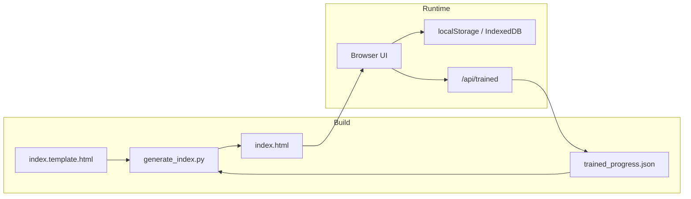

# Country Index

A dark, lightweight browser for **continent → country → state / province** hierarchies on disk. Mark jurisdictions with **JSONL** (complete) and **ongoing** toggles; progress syncs via local preview, a small dev server, or optional file handles.

---

## Features

| | |
|---|---|
| **Hierarchical navigation** | Card grid with breadcrumbs across continents, countries, and states |
| **Progress tracking** | Per-jurisdiction ✓ (JSONL) and ● (ongoing) toggles |
| **Self-contained build** | `generate_index.py` embeds the folder tree and progress into one `index.html` |
| **Flexible persistence** | localStorage, IndexedDB, File System Access API, or `trained_progress.json` via the dev server |
| **No npm** | HTML, CSS, JavaScript; Python 3 only for tooling |

---

## Quick start

### Regenerate after data changes

```bash
python3 generate_index.py
```

### Open the UI

**Editor preview** — Open `index.html` in a static/HTML preview. Toggles persist in the browser.

**Local server** — Persists toggles to `trained_progress.json`:

```bash
python3 serve_index.py
# optional: python3 serve_index.py 9000
```

Visit [http://127.0.0.1:8765/index.html](http://127.0.0.1:8765/index.html).

---

## Repository layout

```
Country_Index/
├── generate_index.py       # Build index.html from template + data
├── serve_index.py          # Local dev server + progress API
├── index.template.html     # UI source (placeholders for injected JSON)
├── index.html              # Generated app (open in browser)
├── trained_progress.json   # Shared progress when using serve_index.py
├── README.md
└── LICENSE
```

---

## How it works



1. **`generate_index.py`** builds **`index.html`** from the template and embedded progress data.
2. The UI merges embedded data with saved progress and debounces writes on toggle.
3. **`serve_index.py`** serves static files and GET/POST **`/api/trained`** for `trained_progress.json`.

### Progress keys

| Level | Key format | Example |
|-------|------------|---------|
| Continent | `continent/{id}` | `continent/Africa` |
| Country | `{continent}/{country}` | `Africa/Nigeria` |
| State | `{continent}/{country}/{state}` | `Africa/Nigeria/Lagos` |

Each entry: `{ "jsonl": bool, "ongoing": bool }`. Legacy boolean values in JSON are normalized on load.

---

## Files

| File | Role |
|------|------|
| `index.template.html` | Source UI; placeholders for injected JSON |
| `index.html` | Generated standalone app |
| `generate_index.py` | Rebuild `index.html` |
| `serve_index.py` | Static server + `/api/trained` (default port **8765**) |
| `trained_progress.json` | Progress store when using the dev server |

---

## Tips

- Run **`python3 generate_index.py`** after updating jurisdiction data, then refresh the browser.
- Commit **`trained_progress.json`** for shared progress; regenerate to embed it in `index.html` for offline use.

---

## License

Released under the **[MIT License](LICENSE)**. You may use, copy, modify, merge, publish, distribute, sublicense, and/or sell copies, including in your own apps or products — commercial or personal. Include the copyright notice and license text when you redistribute the software.

See [LICENSE](LICENSE) for the full terms.
